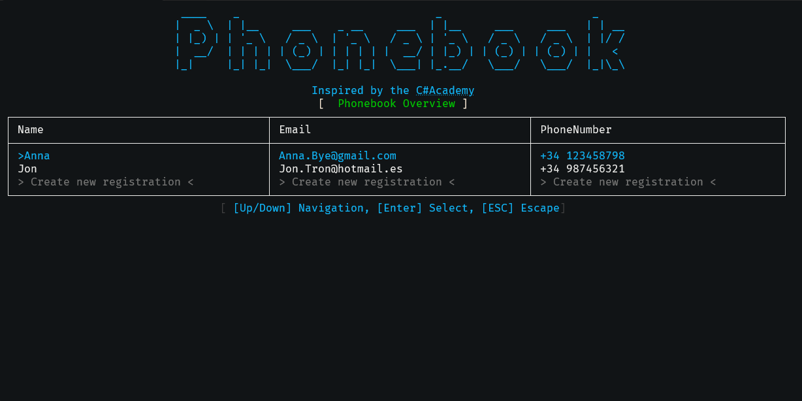

# Phonebook App

The **Phonebook App** is an interactive console application
designed to manage contact information efficiently.

Inspired by the [C# Academy Phonebook Project](https://thecsharpacademy.com/project/16/phonebook).

## 📸 Overview

## How It Works

### Console Application:
1. **Launch the App.**
2. **Navigate the Menu** using arrow keys.
3. **View Contacts:** See an overview of saved contacts.
4. **Manage Contacts:** Add, edit, or remove contacts.
5. **Exit the App** using the provided menu option.

## Technologies Used

- **Entity Framework Core** - ORM for database interactions.
- **SQL Server** - Data storage.
- **Spectre.Console** - Interactive console UI.
